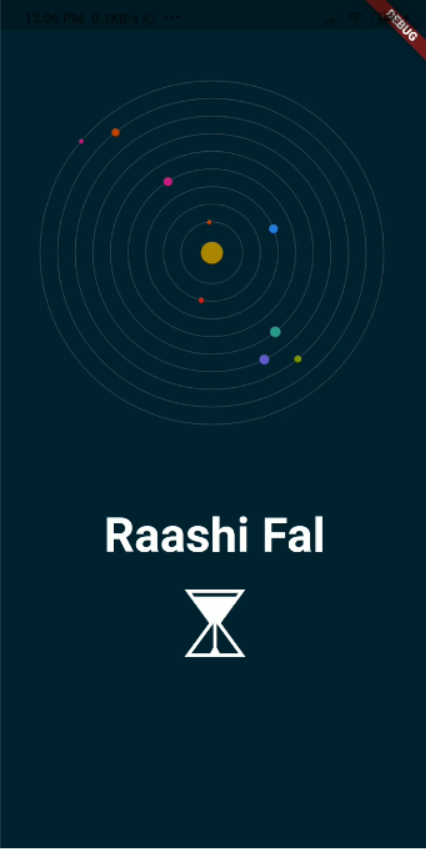
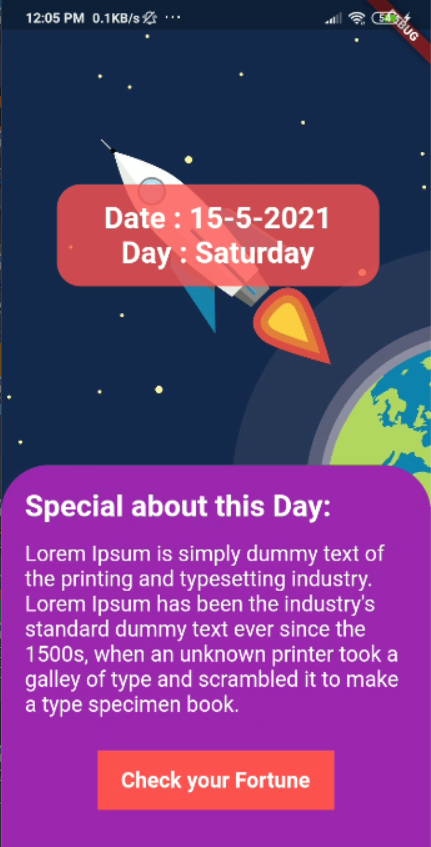
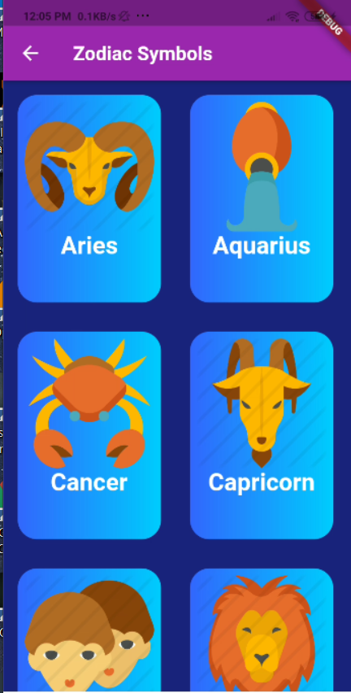
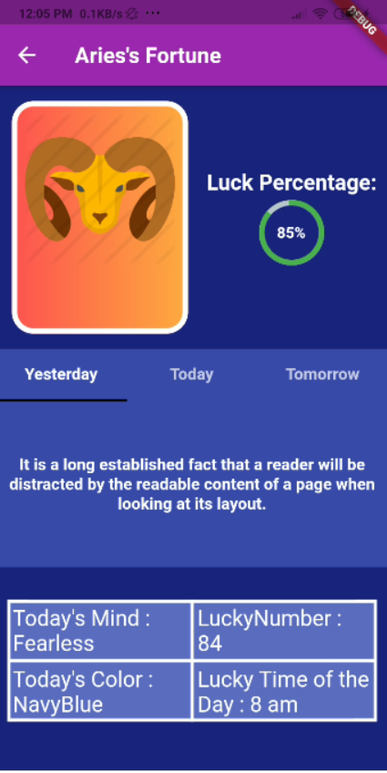

# Horrorscope Mobile Application 👻 🔥

♈ ♐ ♊ ♒ ♋ ♑ ♓ ♏ ♉ ♍ ♌ ♎

## Introduction

Its UI for an HorrorScope Mobile Application which is made in flutter. It is not connected to any API yet. Only Sample text has been used in this mobile application

## Requirements ❔

To run this application on your system, you required the following: - 

1. Flutter SDK 🖥️
2. Android Device 📱
3. Any IDE (Preferably Android Studio) 📔

## Screenshots of Mobile Application

|                 Loading Screen                 |                 Home Screen                       |                
|:-------------------------------------------------:|:-------------------------------------------------:|
|  |  |

 

|                 Zodiac Symbol Screen              |                 Zodiac Fortune Screen                       |                      
|:-------------------------------------------------:|:-------------------------------------------------:|
|  |  |  |

## Contribution 🙆

1. Anyone who finds any bugs can report to owner of the repository.
2. Any sort of Contributions are welcome.

## Built by Developers </>
## Built with ❤️